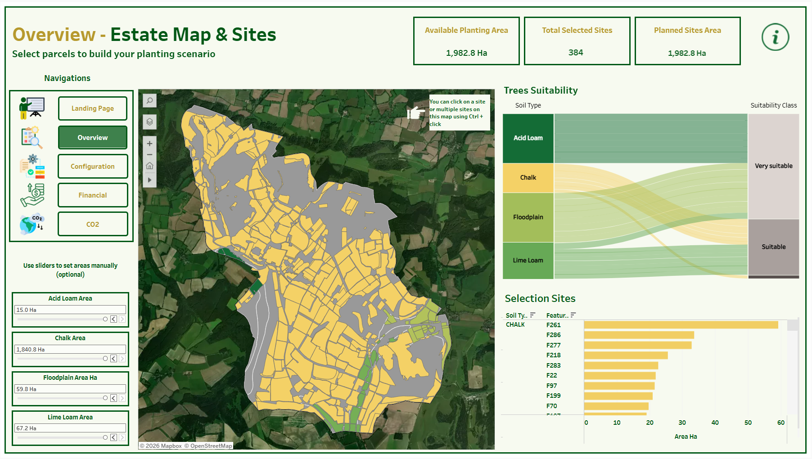
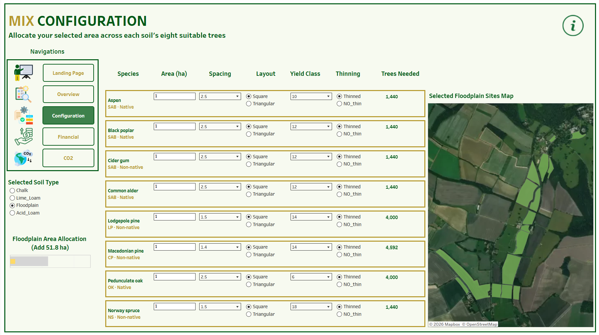
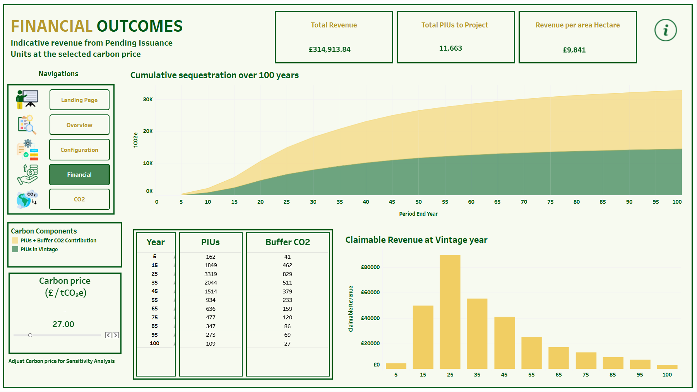
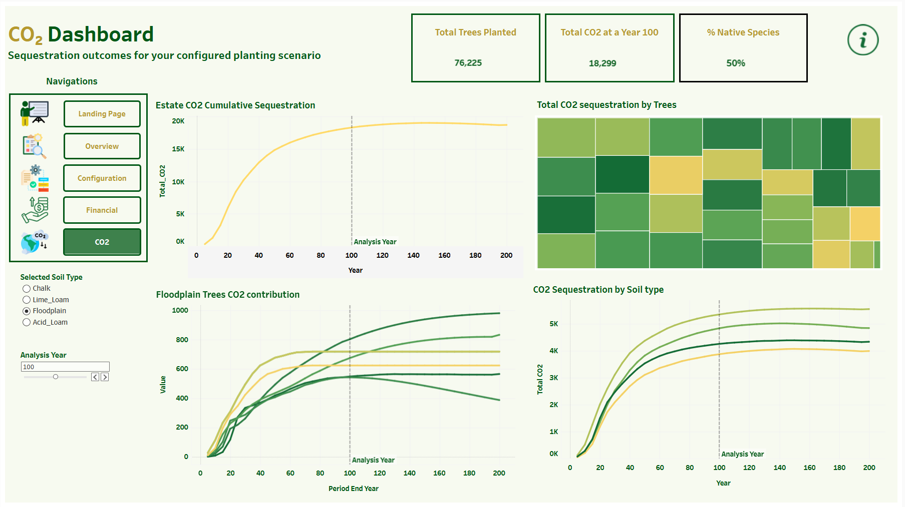

# 🌳 West Dean Estate — Afforestation Decision-Support Tool

A capstone project that helps a private estate decide **where, what and how much to plant**
to create new woodland, and estimates the **carbon sequestration and financial return**
of that planting scenario under the UK Woodland Carbon Code.

> Academic / business problem → approach → findings, in one place. Built as an interactive
> Tableau dashboard on top of GIS site data, ESC species-suitability models and the
> official UK Woodland Carbon Code carbon calculator.

---

## 📌 Table of Contents

- [Project Overview](#-project-overview)
- [Repository Structure](#-repository-structure)
- [Data Sources](#-data-sources)
- [Methodology](#-methodology)
- [Dashboard](#-dashboard)
  - [1. Landing Page](#1--landing-page)
  - [2. Overview — Estate Map & Sites](#2--overview--estate-map--sites)
  - [3. Mix Configuration](#3--mix-configuration)
  - [4. Financial Outcomes](#4--financial-outcomes)
  - [5. CO₂ Dashboard](#5--co-dashboard)
- [How to Use](#-how-to-use)
- [Key Findings](#-key-findings)
- [Limitations & Future Work](#-limitations--future-work)
- [Authors](#-authors)
- [License](#-license)

---

## 🎯 Project Overview

**Business problem:** West Dean Estate wants to expand its woodland cover but needs an
evidence-based way to answer three questions before committing land and capital:

1. **Where** on the estate is land actually suitable for planting, given soil type and site conditions?
2. **What** species mix should be planted on each soil type to maximise growth and carbon capture?
3. **What return** — in tCO₂e sequestered and in £ from carbon credit (PIU) sales — can the estate expect?

**Our approach:** we combined estate parcel/soil GIS data, Forest Research's Ecological Site
Classification (ESC) species-suitability outputs, a species-to-carbon-model crosswalk, and the
official Woodland Carbon Code carbon calculator into a single interactive Tableau dashboard that
lets a user select parcels, configure a species mix per soil type, and immediately see the
projected carbon sequestration and revenue over a 100-year project life.

**Key finding (headline scenario):** a 7-site, ~103 ha planting scenario across the estate's four
soil types (Chalk, Acid Loam, Floodplain, Lime Loam) is projected to sequester **~17,500 tCO₂e**
and generate **~£405,500** in indicative Pending Issuance Unit (PIU) revenue at a carbon price of
£36/tCO₂e over 100 years. See [Dashboard](#-dashboard) and [Key Findings](#-key-findings) below.

---

## 📁 Repository Structure

```
├── README.md                              # This file
├── dashboard_images/                      # Exported screenshots of the Tableau dashboard
│   ├── 01_landing_page.jpg
│   ├── 02_overview_estate_map.jpg
│   ├── 03_mix_configuration.jpg
│   ├── 04_financial_outcomes.jpg
│   └── 05_co2_dashboard.jpg
└── poster/
    └── Poster       
```

> **Note:** the Tableau workbook (`.twbx`) that renders the live dashboard is not included in this
> repo — the `dashboard_images/` folder contains static exports of every page for reference. If you
> have access to the source workbook, add it here (e.g. `dashboard/West_Dean_Dashboard.twbx`) and
> update this README with a link to Tableau Public / Tableau Server.

---

## 🗂 Data Sources

| File | Description |
|---|---|
| `acid_loam_suitability.csv`, `chalk_suitability.csv`, `lime_loam_suitability.csv`, `floodplain_suitability.csv` | Output from Forest Research's **Ecological Site Classification (ESC)** Decision Support System for each soil type present on the estate. Each file reports site variables (accumulated temperature, continentality, exposure/DAMS, moisture deficit, soil moisture & nutrient regime) and, for every candidate species, a **suitability score** (0–1) bucketed into `Very Suitable` (≥0.75), `Suitable` (0.5–0.75), `Marginal` (0.3–0.5) and `Unsuitable` (<0.3). |
| `Species_Suitability_Crosswalk.xlsx` | Reconciles the **63 ESC species codes** used in the suitability files against the carbon calculator's `Species_Lookup` table, resolving each to the `species_model_to_use` group used to join into the carbon-sequestration lookup. Of 62 species: 49 matched by name exactly, 9 required manual name harmonisation, and 4 had no direct match and used a model-group fallback. |
| `CarbonCalculator.xlsx` | The official **UK Woodland Carbon Code Carbon Calculator (Version 3.0, August 2025)**, used unmodified as the sequestration/PIU-issuance engine. Contains the Standard and Small Project calculators, biomass carbon and clearfell lookup tables, species lookup, and validation lists. |
| `Poster` | Module brief describing the A1 poster submission format and content requirements for the oral defense. |

---

## 🔬 Methodology

1. **Site classification** — Estate parcels were grouped into four soil types: Chalk, Acid Loam,
   Lime Loam and Floodplain.
2. **Species suitability** — For each soil type, the ESC suitability output ranks all candidate
   species by how well local climate and soil conditions match their ecological requirements.
3. **Species → carbon model mapping** — The crosswalk file resolves each ESC species code to the
   correct species/yield-class entry in the Woodland Carbon Code lookup tables, since the two
   systems don't always use identical naming.
4. **Carbon & revenue modelling** — For a user-selected mix of species, spacing, yield class and
   thinning regime per soil type, the Carbon Calculator projects tCO₂e sequestered per period,
   Pending Issuance Units (PIUs), and indicative revenue at a chosen carbon price, over a
   100-year (or user-defined) project duration.
5. **Visualisation** — All of the above is exposed through an interactive Tableau dashboard so a
   non-technical estate manager can select sites on a map, configure a mix, and see the financial
   and carbon outcomes update live.

---

## 📊 Dashboard

Each page below follows the same documentation template — **Purpose · Key elements · What it
answers · Screenshot** — so the pages are easy to compare and to keep consistent if new pages are
added later.

### 1 · Landing Page

| | |
|---|---|
| **Purpose** | Branded entry point to the tool, framing it as the estate's own decision-support tool. |
| **Key elements** | Estate imagery, tool title, single "Enter The Dashboard" call to action. |
| **What it answers** | *"What is this tool and whose estate is it for?"* |


### 2 · Overview — Estate Map & Sites

| | |
|---|---|
| **Purpose** | Lets the user explore the estate map and build a planting scenario by selecting parcels. |
| **Key elements** | Interactive parcel map (click / Ctrl+click to multi-select), KPI tiles (Available Planting Area, Total Selected Sites, Planned Sites Area), soil-type area breakdown, and a bar chart of selected sites by soil type and feature ID. |
| **What it answers** | *"Which parcels are available, which have I selected, and how much area/soil type do they represent?"* |



### 3 · Mix Configuration

| | |
|---|---|
| **Purpose** | Lets the user design the species mix for the currently selected soil type. |
| **Key elements** | Per-species table (area, spacing, layout — square/triangular, yield class, thinning regime, trees needed) for each soil's eight locked species; soil selector; area-allocation slider; map of the selected sites for that soil type. |
| **What it answers** | *"What should I plant, at what density and management regime, on each soil type?"* |



### 4 · Financial Outcomes

| | |
|---|---|
| **Purpose** | Translates the planting scenario into indicative carbon-credit revenue. |
| **Key elements** | KPI tiles (Total Revenue, Total PIUs to Project, Revenue per Hectare); cumulative sequestration area chart (PIUs + buffer vs. PIUs in vintage) over 100 years; year-by-year PIU/buffer CO₂ table; claimable revenue by year bar chart; adjustable carbon price. |
| **What it answers** | *"What is this scenario worth, and when does revenue actually get realised?"* |



### 5 · CO₂ Dashboard

| | |
|---|---|
| **Purpose** | Shows the carbon-sequestration performance of the configured scenario in detail. |
| **Key elements** | KPI tiles (Total Trees Planted, Total CO₂ at a Year); full-estate cumulative sequestration curve with adjustable analysis year; per-soil-type CO₂ curves; treemap of sequestration contribution by soil type. |
| **What it answers** | *"How much carbon will this scenario capture, how does that build up over time, and which soil types/areas contribute most?"* |



---

## ▶️ How to Use

1. Clone this repository.
2. Open `carbon_model/CarbonCalculator_V1.xlsx` to inspect or re-run the underlying carbon
   calculations, or open the suitability CSVs in `data/` to see the ESC species rankings per soil type.
3. If you have the Tableau source workbook, place it under `dashboard/` and open it in Tableau
   Desktop/Public to interact with the live version of the dashboard shown in
   [`dashboard_images/`](dashboard_images).
4. To reproduce the scenario shown in the screenshots: select the 7 highlighted sites on the
   Overview map (Chalk: F97, F199, F107, F13, F182; Acid Loam: F111; Floodplain: F179_a), configure
   the species mix per soil on the Configuration page, then review results on Financial and CO₂.

---

## ✅ Key Findings

- **~1,983 ha** of the estate is classified as available planting area across four soil types.
- The example scenario plants **~103 ha** across **7 sites** (mostly Chalk, plus Acid Loam and
  Floodplain), using **~74,800 trees**.
- Projected outcome over 100 years: **~17,500 tCO₂e** sequestered, **~11,265 PIUs**, and
  **~£405,500** in indicative revenue (**~£13,000/ha**) at a **£36/tCO₂e** carbon price.
- Of the 63 ESC species codes considered, 49 mapped directly onto the carbon calculator's species
  groups, 9 required manual name reconciliation, and 4 needed a fallback model group — a
  reminder that ecological and carbon-accounting datasets don't always speak the same language
  out of the box.

---

## 👥 Authors

*Add your name(s), programme and academic year here, e.g.:*

- Dheeraj Chavan, Piyush Patil, Mrunmayee Bhavsar 
- MSc Business Analytics, UCD Smurfit, 2026 Capstone Project

---

## 📄 License

*This is an academic project not intended for reuse without permission.*
